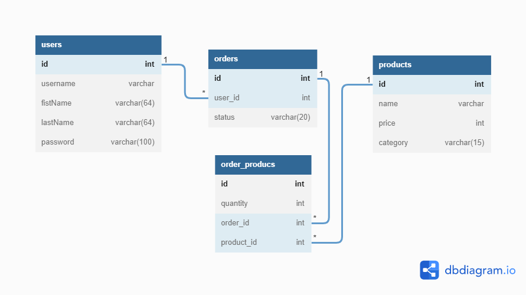

# Storefront Backend Project

- [Storefront Backend Project](#storefront-backend-project)
  - [Project Overview](#project-overview)
  - [Usage](#usage)
    - [1. Install](#1-install)
    - [2. Create Database & start server](#2-create-database--start-server)
    - [3. Testing](#3-testing)
  - [Data Structure](#data-structure)
  - [Endpoints](#endpoints)

## Project Overview

The company stakeholders want to create an online storefront to showcase their great product ideas. Users need to be able to browse an index of all products, see the specifics of a single product, and add products to an order that they can view in a cart page. You have been tasked with building the API that will support this application, and your coworker is building the frontend.

These are the notes from a meeting with the frontend developer that describe what endpoints the API needs to supply, as well as data shapes the frontend and backend have agreed meet the requirements of the application.

## Usage

### 1. Install

- Run `yarn install` or `npm install` to install all the packages needed.

- Edit `.env_template` with your setting and change the file name to `.env`

```
POSTGRES_USER= **
POSTGRES_PASSWORD= **
POSTGRES_HOST= **
POSTGRES_DB= **
ENV=dev
POSTGRES_TEST_DB= **
BCRYPT_PASSWORD= **
SALT_ROUNDS= **
TOKEN_SECRET= **
```

- Edit `database_template.json` for both `dev` and `test` environment with correct setting

- Rename it as `database.json`

```
{
  "dev": {
    "driver": **,
    "host": **,
    "database": **,
    "user": **,
    "password": **"
  },
  "test": {
    "driver": **,
    "host": **,
    "database": **,
    "user": **,
    "password": **
  }
}
```

- Make sure [Docker](https://www.docker.com/) is installed in your computer and run `docker-compose up` with the setting in `docker-compose.yml`

### 2. Create Database & start server

- Create your database by running `db-migrate db:create [Customised Database Name]`

- Run `db-migrate up` to establish database tables

- Run `yarn start` or `npm run start` to start server in the default port `3000`

### 3. Testing

- `yarn test` or `npm run test`

## Data Structure



## Endpoints

Please refer to `REQUIREMENTS.md`.
