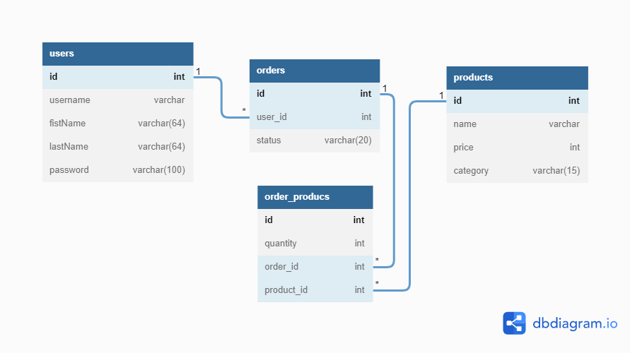

# API Requirements

The company stakeholders want to create an online storefront to showcase their great product ideas. Users need to be able to browse an index of all products, see the specifics of a single product, and add products to an order that they can view in a cart page. You have been tasked with building the API that will support this application, and your coworker is building the frontend.

These are the notes from a meeting with the frontend developer that describe what endpoints the API needs to supply, as well as data shapes the frontend and backend have agreed meet the requirements of the application.

- [API Requirements](#api-requirements)
  - [API Endpoints](#api-endpoints)
      - [Products](#products)
      - [Users](#users)
      - [Orders](#orders)
  - [Data Shapes](#data-shapes)
      - [Product](#product)
      - [User](#user)
      - [Orders](#orders-1)
      - [Order_products](#order_products)

## API Endpoints

Default port: `http://localhost:3000`

#### Products

_All are token required_

- Index : `GET` - `/products`
- Show : `GET` - `/product/:product_id`
- Create : `POST` - `/product`
  - with `requst body` including `name`, `price`, `category`
- Products by category : `GET` - `/product/:category`
- Update : `PUT` - `/product/:product_id`
  - with `requst body` including `name`, `price`, `category`
- Delete : `DELETE` - `/product/:product_id`

#### Users

_All are token required except 'Register'_

- Register : `POST` - `/user/`
  - with `requst body` including `username`, `first_name`, `last_name`, `password`
- Index : `GET` - `/users`
- Show : `GET` - `/user/:user_id`
- Get Orders by User ID : `GET` - `/user/:user_id/orders`
- Edit : `PUT` - `/user/:user_id`
  - with `requst body` including `username`, `first_name`, `last_name`, `password`
- Delete : `DELETE` - `/user/:user_id`

#### Orders

_All are token required_

- Index : `GET` - `/orders`
- Show : `GET` - `/order/:order_id`
- Create a new order : `POST` - `/order/create/:user_id`
- Add an item to an order : `POST` - `/order/:order_id`
  - with `requst body` including `product_id`, `quantity`
- Edit item : `PUT` - `/order/item/:order_products_id`
  - with `requst body` including `product_id`, `quantity`
- Delete item : `DELETE` - `/order/item/:order_products_id`
  - with `requst body` including `product_id`, `quantity`
- Delete order : `DELETE` - `/order/:order_id`

## Data Shapes

#### Product

- id
- name
- price
- category

#### User

- id
- username
- firstName
- lastName
- password

#### Orders

- id
- user_id
- status

#### Order_products

- id
- quantity
- order_id
- product_id
